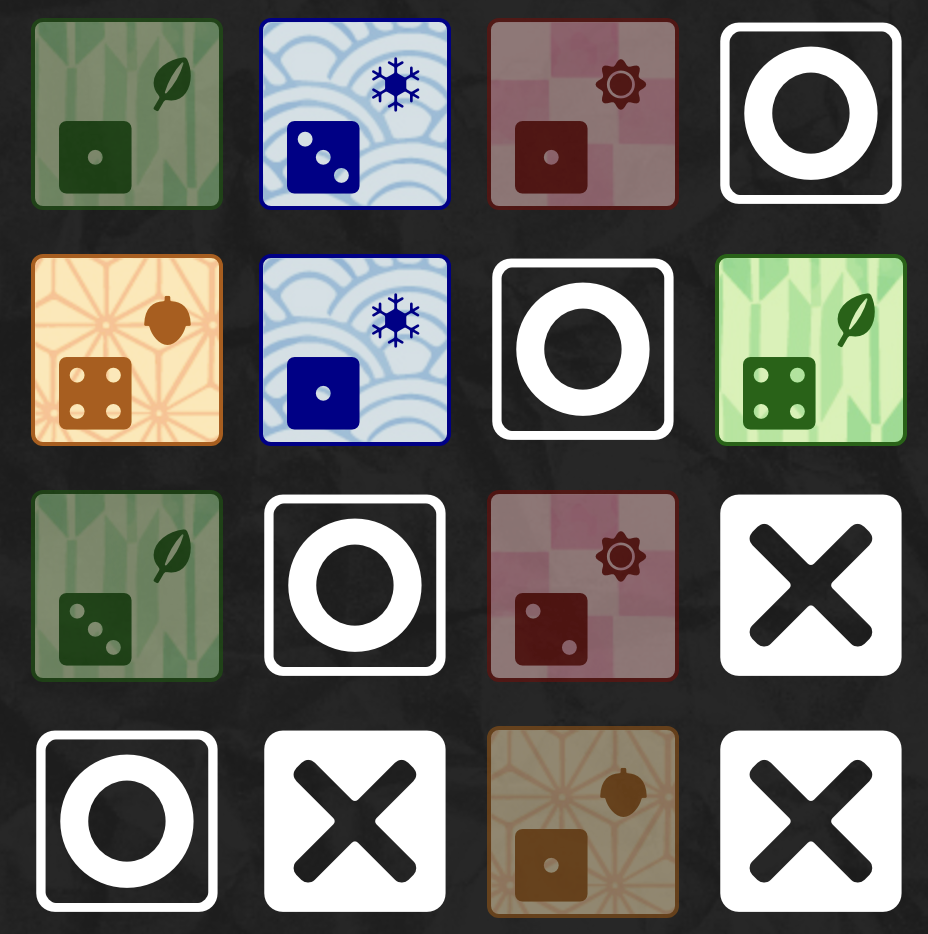
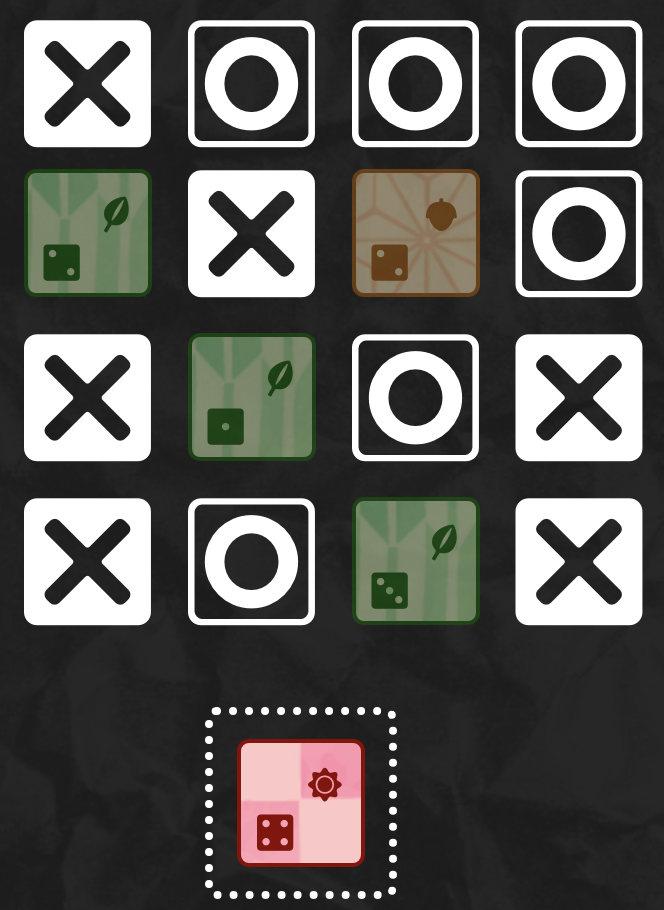
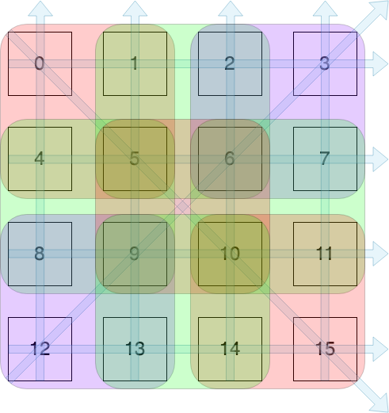

# colinmakes.games

[colinmakes.games](https://www.colinmakes.games) is a web based multiplayer card & board game platform. Users can create or join matches and play against other users in real time. My intention is for this application to act as a platform for play-testing and showcasing my original game designs. Currently there is one game, **Setto**, available to play, the rules of which can be found below.


## How to play Setto

Players alternate turns replacing a card in the grid with their mark. On their turn, players must choose a card which matches either the suit or the value of the card last chosen by their opponent (on the first turn, any card can be chosen).

The first player to place four of their marks in a line (horizontally, vertically, or diagonally) or in a square, is the winner. Alternatively, a player loses if there are no legal moves on their turn.

|   win via diagonal line   |  loss via no legal moves   |
| :-----------------------: | :------------------------: |
|  |  |

## Local Development

Clone this repository, install dependencies:

```bash
npm install
```

Create a `.env.development` file in the root directory and add the following:

```txt
NEXT_PUBLIC_URL=http://localhost:8000
```

Run the development server:

```bash
npm run dev
```

Open [http://localhost:3000](http://localhost:3000) with your browser to see the result.

A separate server is used facilitate multiplayer. Access that repository [here](https://github.com/tressc/colinmakes.games-server) and follow the instructions in the accompanying readme to run locally.

## Project Structure

Currently, there are three routes, all found in the `src/app` directory.

- The landing page, where users sign in.
- Lobby, where they can create or join matches.
- Match, where games are played.

The latter two routes are protected by a function found in `src/utils/withProtectedRoute.jsx`, which will redirect users to the landing page if they are not signed in.

Because the current user's data is used in almost every component, it is stored in a React context, the provider for which wraps the entire application in `src/app/layout.tsx`.

This project leverages the [boardgame.io](https://boardgame.io/) library to define gameplay and facilitate multiplayer functionality.

The `src/games` directory contains files which define game behavior, such as legal moves, endgame conditions, and state.

- For example `setto.ts` defines an object `setMemberships` which maps each grid cell to all the scoring opportunities it is a member of. An opportunity in this context is any row, column, diagonal, or square of 4 cells. These are are tracked in an integer array `sets` where each index is assigned to a single opportunity. When a player claims a cell, every opportunity is de/incremeted by 1. If the absolute value of an opportunity is ever 4, the game is over and the current player has won.

- 

The `src/boards` directory determine how these games should be presented on the client.

A [separate node server](https://github.com/tressc/asobi-server) hosts REST endpoints for lobby actions such as creating and joining matches, and [socket.io](https://socket.io/) connections for updating matches between multiple users in real time.

## Features

- [x] Real time multiplayer
- [x] Mobile friendly
- [ ] User authentication
- [ ] Match history
- [ ] Animations
- [ ] More games

## Technologies

- [Next.js](https://nextjs.org/)
  - Next.js has emerged as a popular framework and I wanted to use this project as an opportunity to learn it.
- [boardgame.io](https://boardgame.io/)
  - boardgame.io provides an API for matchmaking, socket connections, and managing game state. Using it allowed for more rapid prototyping and development.
- [Tailwind CSS](https://tailwindcss.com/)
  - Like Next.js, I used this project as a chance to learn Tailwind, a library that has seen widespread adoption in recent years.
- [TypeScript](https://www.typescriptlang.org/)
  - TypeScript has become an industry standard and my preferred way to write web applications.

## Credits

- Japanese localization: Momo sensei
- [Dicier Font](speakthesky.itch.io/typeface-dicier), Speak the Sky, [CC BY4.0 Licence](creativecommons.org/licenses/by/4.0/)
- Images from [https://livinginjapan.net/](https://livinginjapan.net/)
- Setto inspired by [Okiya](https://boardgamegeek.com/boardgame/125311/okiya)
